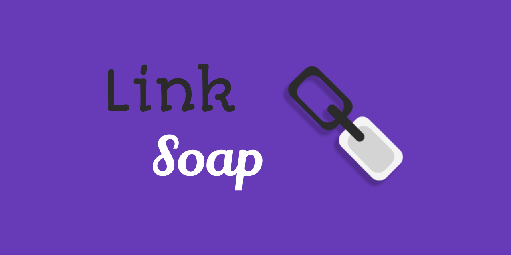

# LinkSoap

Launder your clipboard.

## What is this?

Do you feel bad for sending tracking links to your friends? Do you manually and painstakingly edit all the URLs you wanna share? Fear not, that era is behind us now!

LinkSoap is a flutter application that helps you autotmatically sanitize things you wanna share. The mechanism is slightly different depending on the platform, but the end result is the same: You can quickly have your links cleaned up in the desired fashion (custom rules, woo!!) before sharing them with anyone.

## Features

- Use Regex to create custom rules for modifying URLs
- Define "Detergents" for removing Query Parameters from URLs
- Define "Softeners" for replacing Domain names in URLs
- Windows: Monitor clipboard automatically and replace URLs on the fly
- Android: Share URLs to LinkSoap to copy cleaned URLs to clipboard
- A small history of your last cleaned URLs

> [!TIP]
> LinkSoap is still unfinished! Support for other desktop platforms, or better link modification rules may come in the future.

## Download

```sh
// TODO: Add release pipeline
```

## Building from source

1. Make sure you have Flutter installed. We recommend using [Puro](https://puro.dev/).
2. Clone this repository:

   ```sh
   git clone https://github.com/clragon/linksoap.git
   cd linksoap
   ```

3. Either  
   a. Start the application:

   ```sh
   flutter run
   ```

   Or  
   b. Package an installer:

   ```sh
   dart pub global activate fastforge
   # OS can be: windows, android
   # File can be exe, apk
   fastforge package --platform=<OS> --targets=<File>
   ```
